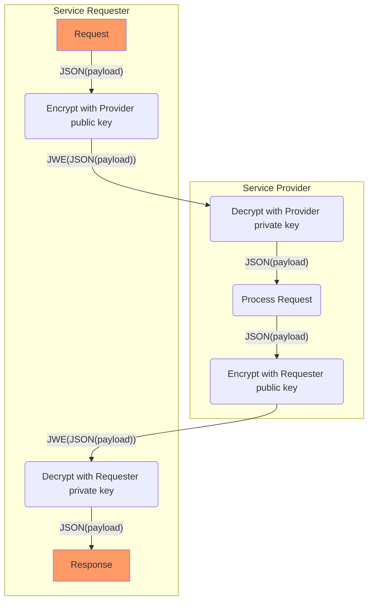

# Design rules

<div class="rule" id="/encryption/jwe" data-type="technical">
   <p class="rulelab">Use JSON Web Encryption (JWE)</p>
   <dl>
   <dt>Statement</dt>
   <dd>

For HTTP payload encryption [[[rfc7516]]] MUST be applied with the following requirements.

* The request is sent to Service Provider with `content-type: application/jose+json`.

* An encrypted request needs to pass application/jose+json as the value for the Content-Type and Accept headers:
```
Content-Type: application/jose+json
Accept: application/jose+json
```

* When the encrypted request uses an unsupported algorithm, the Service Provider rejects the request with a 400 HTTP response.

* Use for encryption the public key from the X.509 certificate of the other party
* Use the following parameters in the JWE protected header:
```
alg : "RSA-OAEP", 
enc : "A256GCM",
typ : "JWE"
```

* JWE compact serialization format is used

The following algorithms MUST be applied used.
* Key Management: [RSA-OAEP](https://datatracker.ietf.org/doc/html/rfc7518#section-4.3)
* Content encryption: [A256GCM](https://datatracker.ietf.org/doc/html/rfc7518#section-5.3)
   </dd>
</dl>
</div>


## Basic JWE proces flow

The basic flow for encryption using JWE is :



<figure><figcaption>Encryption</figcaption></figure>


* 1 Service Requester encrypts payload using Service Provider public encryption key:

* 2 Service Provider decrypts the request using the corresponding Service Provider private encryption key.

* 3 Service Provider performs the request and then generates an encrypted response;

* 4 Service Requester decrypts response using Requester private key
